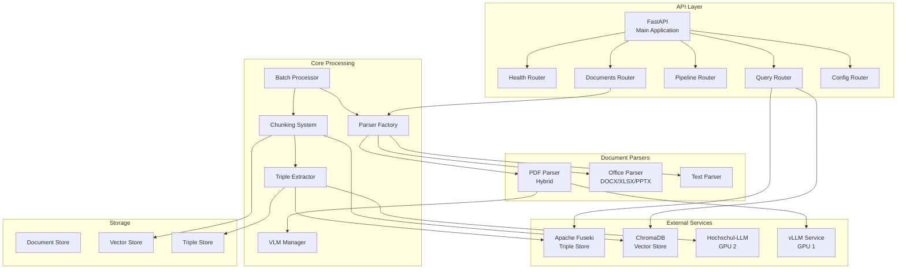
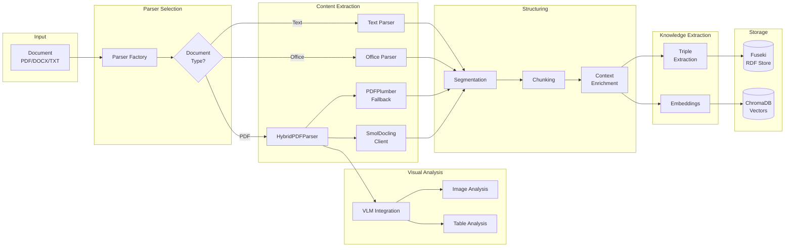
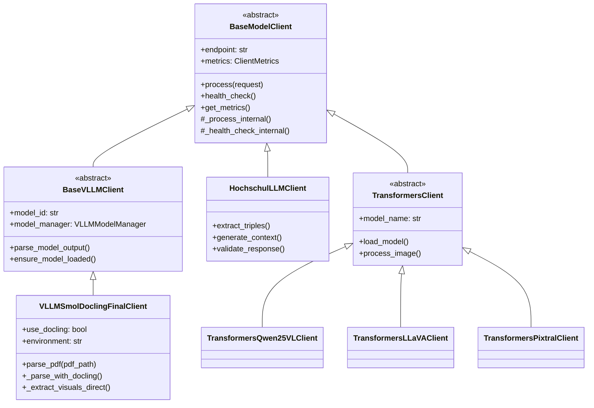
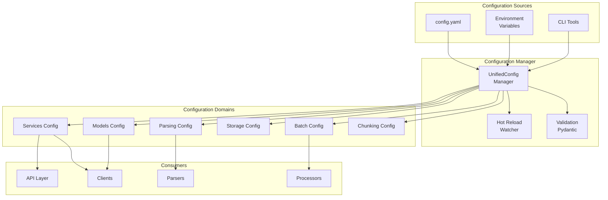
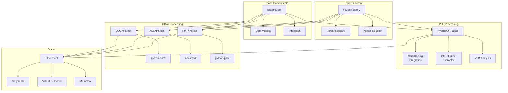
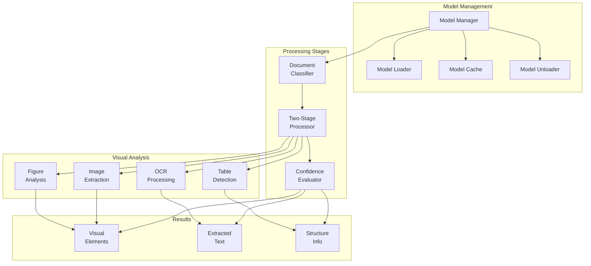
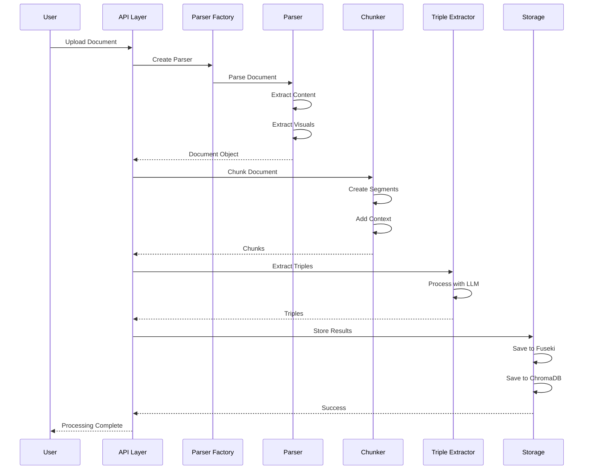
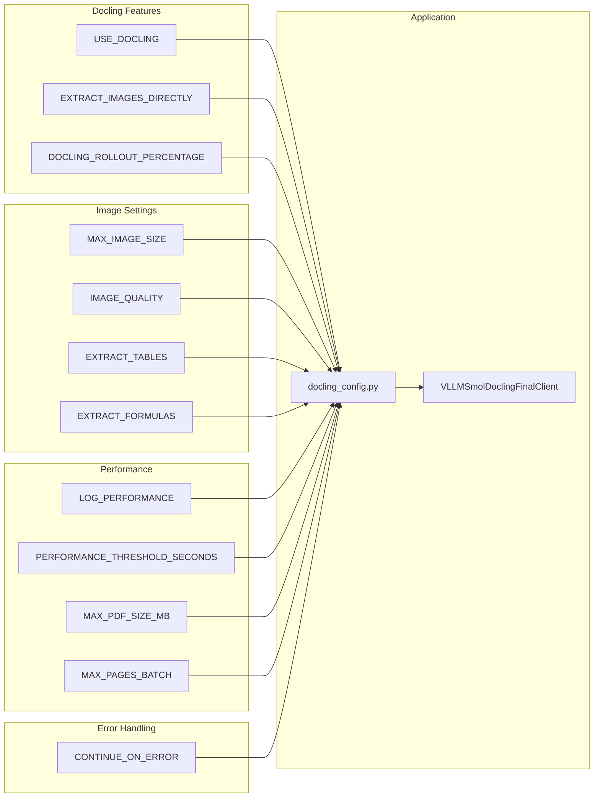

# Generic Knowledge Graph Pipeline - Architecture Documentation

## 1. High-Level System Architecture

## 2. Document Processing Pipeline

## 3. Client Architecture

## 4. Configuration System

## 5. Parser System Architecture

## 6. VLM Processing Pipeline

## 7. Data Flow Sequence

## 8. Environment Variable Configuration

## Key Architecture Principles

1. **Separation of Concerns**: Clear boundaries between parsing, processing, and storage
2. **Extensibility**: Plugin architecture for parsers and processors
3. **Scalability**: Async processing, separate GPU workloads
4. **Resilience**: Fallback mechanisms, retry logic, error handling
5. **Configurability**: Environment-based configuration with hot reload
6. **Observability**: Comprehensive logging, metrics, and health checks

## Technology Stack

- **Framework**: FastAPI (async Python)
- **Document Processing**: PyMuPDF, PDFPlumber, python-docx
- **VLM**: vLLM, Transformers, SmolDocling
- **Storage**: Apache Fuseki (RDF), ChromaDB (Vectors)
- **Configuration**: Pydantic, YAML
- **Monitoring**: Custom metrics, health endpoints