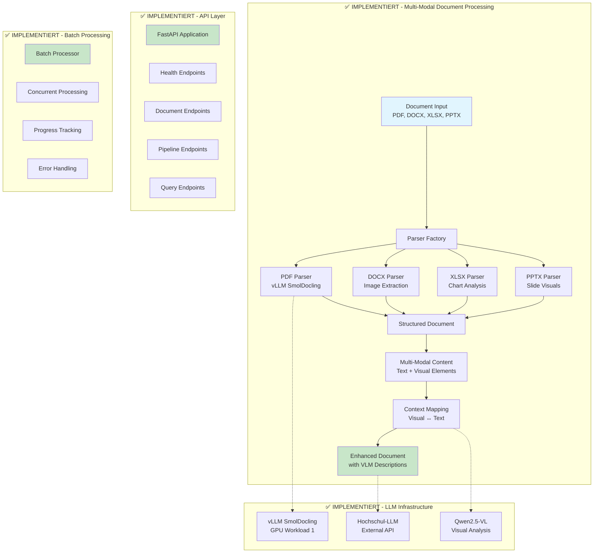
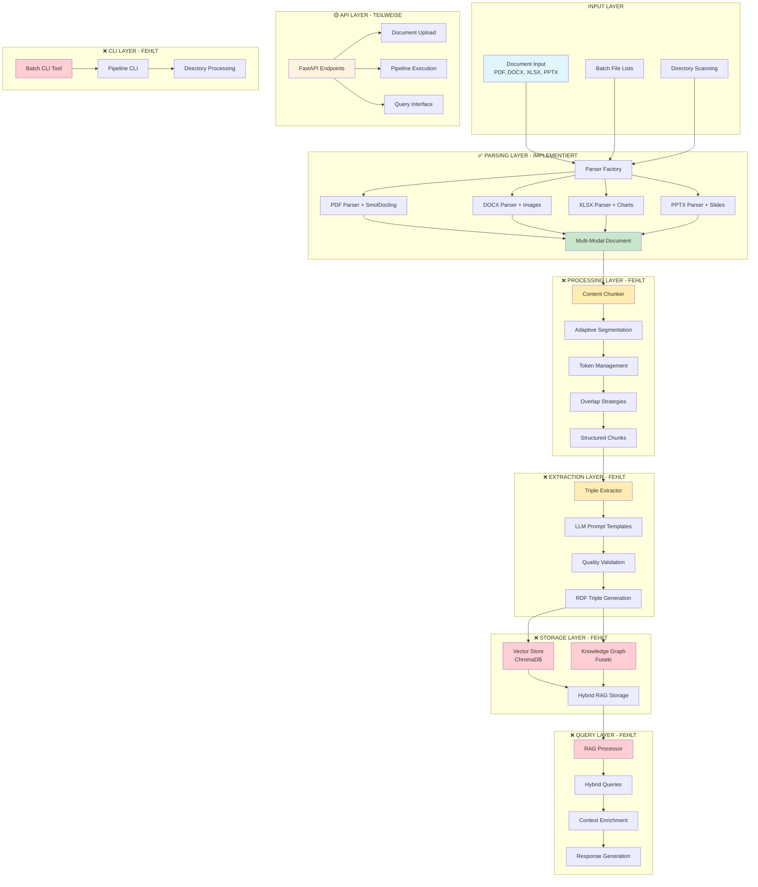

# Aktueller vs. Ziel-Stand: Mermaid Diagramme

## 1. Aktueller Implementierungsstand

```mermaid
graph TB
    subgraph "✅ IMPLEMENTIERT - Multi-Modal Document Processing"
        A[Document Input<br/>PDF, DOCX, XLSX, PPTX] --> B[Parser Factory]
        B --> C1[PDF Parser<br/>vLLM SmolDocling]
        B --> C2[DOCX Parser<br/>Image Extraction]
        B --> C3[XLSX Parser<br/>Chart Analysis]
        B --> C4[PPTX Parser<br/>Slide Visuals]
        
        C1 --> D[Structured Document]
        C2 --> D
        C3 --> D
        C4 --> D
        
        D --> E[Multi-Modal Content<br/>Text + Visual Elements]
        E --> F[Context Mapping<br/>Visual ↔ Text]
        F --> G[Enhanced Document<br/>with VLM Descriptions]
    end
    
    subgraph "✅ IMPLEMENTIERT - LLM Infrastructure"
        H1[vLLM SmolDocling<br/>GPU Workload 1]
        H2[Hochschul-LLM<br/>External API]
        H3[Qwen2.5-VL<br/>Visual Analysis]
    end
    
    subgraph "✅ IMPLEMENTIERT - API Layer"
        I[FastAPI Application]
        J1[Health Endpoints]
        J2[Document Endpoints]
        J3[Pipeline Endpoints]
        J4[Query Endpoints]
    end
    
    subgraph "✅ IMPLEMENTIERT - Batch Processing"
        K[Batch Processor]
        L[Concurrent Processing]
        M[Progress Tracking]
        N[Error Handling]
    end
    
    %% Connections
    C1 -.-> H1
    F -.-> H3
    G -.-> H2
    
    style A fill:#e1f5fe
    style G fill:#c8e6c9
    style K fill:#c8e6c9
    style I fill:#c8e6c9
```

## 2. Ziel-Architektur (Vollständiges System)

```mermaid
graph TB
    subgraph "INPUT LAYER"
        A[Document Input<br/>PDF, DOCX, XLSX, PPTX]
        A1[Batch File Lists]
        A2[Directory Scanning]
    end
    
    subgraph "✅ PARSING LAYER - IMPLEMENTIERT"
        B[Parser Factory]
        C1[PDF Parser + SmolDocling]
        C2[DOCX Parser + Images]
        C3[XLSX Parser + Charts]
        C4[PPTX Parser + Slides]
        D[Multi-Modal Document]
    end
    
    subgraph "❌ PROCESSING LAYER - FEHLT"
        E[Content Chunker]
        F[Adaptive Segmentation]
        G[Token Management]
        H[Overlap Strategies]
        I[Structured Chunks]
    end
    
    subgraph "❌ EXTRACTION LAYER - FEHLT"
        J[Triple Extractor]
        K[LLM Prompt Templates]
        L[Quality Validation]
        M[RDF Triple Generation]
    end
    
    subgraph "❌ STORAGE LAYER - FEHLT"
        N1[Vector Store<br/>ChromaDB]
        N2[Knowledge Graph<br/>Fuseki]
        O[Hybrid RAG Storage]
    end
    
    subgraph "❌ QUERY LAYER - FEHLT"
        P[RAG Processor]
        Q[Hybrid Queries]
        R[Context Enrichment]
        S[Response Generation]
    end
    
    subgraph "🟡 API LAYER - TEILWEISE"
        T[FastAPI Endpoints]
        U[Document Upload]
        V[Pipeline Execution]
        W[Query Interface]
    end
    
    subgraph "❌ CLI LAYER - FEHLT"
        X[Batch CLI Tool]
        Y[Pipeline CLI]
        Z[Directory Processing]
    end
    
    %% Flow connections
    A --> B
    A1 --> B
    A2 --> B
    
    B --> C1
    B --> C2
    B --> C3
    B --> C4
    
    C1 --> D
    C2 --> D
    C3 --> D
    C4 --> D
    
    D --> E
    E --> F
    F --> G
    G --> H
    H --> I
    
    I --> J
    J --> K
    K --> L
    L --> M
    
    M --> N1
    M --> N2
    N1 --> O
    N2 --> O
    
    O --> P
    P --> Q
    Q --> R
    R --> S
    
    T --> U
    T --> V
    T --> W
    
    X --> Y
    Y --> Z
    
    %% Styling
    style A fill:#e1f5fe
    style D fill:#c8e6c9
    style E fill:#ffecb3
    style J fill:#ffecb3
    style N1 fill:#ffcdd2
    style N2 fill:#ffcdd2
    style P fill:#ffcdd2
    style T fill:#fff3e0
    style X fill:#ffcdd2
```

## 3. Delta-Analyse: Was fehlt

```mermaid
graph LR
    subgraph "PRIORITÄT 1 - Sofort erforderlich"
        A1[Pipeline Core<br/>core/pipeline.py]
        A2[Content Chunker<br/>core/content_chunker.py]
        A3[API Integration<br/>Parser → Endpoints]
        A4[Basic Tests<br/>End-to-End]
    end
    
    subgraph "PRIORITÄT 2 - Phase 2"
        B1[Storage Layer<br/>ChromaDB + Fuseki]
        B2[Triple Extraction<br/>LLM Templates]
        B3[RAG Processor<br/>Hybrid Queries]
        B4[CLI Tools<br/>Batch Processing]
    end
    
    subgraph "PRIORITÄT 3 - Phase 3"
        C1[Advanced Features<br/>Monitoring]
        C2[Production Setup<br/>Docker Compose]
        C3[Performance Optimization<br/>Caching]
        C4[Documentation<br/>User Guides]
    end
    
    %% Progress indicators
    A1 -.-> A2
    A2 -.-> A3
    A3 -.-> A4
    
    A4 -.-> B1
    B1 -.-> B2
    B2 -.-> B3
    B3 -.-> B4
    
    B4 -.-> C1
    C1 -.-> C2
    C2 -.-> C3
    C3 -.-> C4
    
    style A1 fill:#ffcdd2
    style A2 fill:#ffcdd2
    style A3 fill:#ffcdd2
    style A4 fill:#ffcdd2
    style B1 fill:#fff3e0
    style B2 fill:#fff3e0
    style B3 fill:#fff3e0
    style B4 fill:#fff3e0
    style C1 fill:#f3e5f5
    style C2 fill:#f3e5f5
    style C3 fill:#f3e5f5
    style C4 fill:#f3e5f5
```