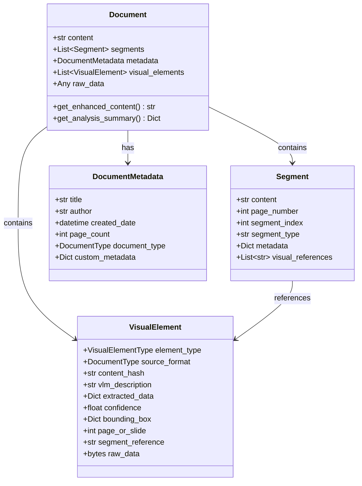
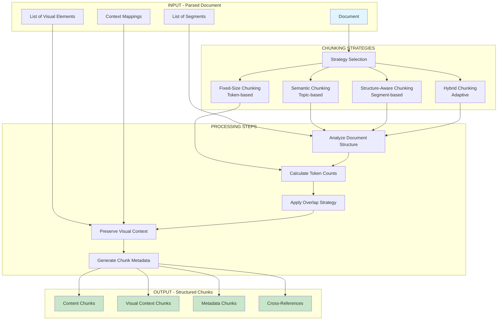

# Struktur eines geparsten Dokuments und Chunking-Strategie

## 1. Struktur eines geparsten Dokuments

### Datenmodell Übersicht



### Beispiel einer konkreten Dokumentstruktur

```python
# Beispiel: Geparste Forschungsarbeit (PDF mit 3 Seiten)
document = Document(
    content="Machine Learning in der Praxis...[vollständiger Text mit VLM-Beschreibungen]",
    
    segments=[
        Segment(
            content="Machine Learning in der Praxis",
            page_number=1,
            segment_index=0,
            segment_type="heading",
            visual_references=["img_hash_123"],
            metadata={
                "font_size": 18,
                "is_title": True,
                "confidence": 0.95
            }
        ),
        Segment(
            content="Machine Learning (ML) ist ein Teilbereich der künstlichen Intelligenz...",
            page_number=1,
            segment_index=1,
            segment_type="paragraph",
            visual_references=["img_hash_123", "chart_hash_456"],
            metadata={
                "paragraph_index": 0,
                "has_references": True,
                "word_count": 150
            }
        ),
        Segment(
            content="Tabelle 1 zeigt die Accuracy verschiedener Algorithmen:\nSVM | 85%\nRF | 92%\nNN | 88%",
            page_number=1,
            segment_index=2,
            segment_type="table",
            visual_references=["table_hash_789"],
            metadata={
                "table_caption": "Tabelle 1: Algorithmus-Vergleich",
                "rows": 4,
                "columns": 2
            }
        )
    ],
    
    visual_elements=[
        VisualElement(
            element_type=VisualElementType.DIAGRAM,
            content_hash="img_hash_123",
            vlm_description="Flussdiagramm zeigt ML-Pipeline mit Dateneingabe, Preprocessing, Training und Evaluation",
            page_or_slide=1,
            segment_reference="paragraph_0",
            confidence=0.92,
            extracted_data={
                "diagram_type": "flowchart",
                "components": ["Data Input", "Preprocessing", "Training", "Evaluation"]
            }
        ),
        VisualElement(
            element_type=VisualElementType.CHART,
            content_hash="chart_hash_456", 
            vlm_description="Balkendiagramm vergleicht Accuracy verschiedener ML-Algorithmen",
            page_or_slide=1,
            segment_reference="table_2",
            confidence=0.95,
            extracted_data={
                "chart_type": "bar",
                "x_axis": "Algorithmus",
                "y_axis": "Accuracy (%)",
                "data_points": {"SVM": 85, "RF": 92, "NN": 88}
            }
        )
    ],
    
    metadata=DocumentMetadata(
        title="Machine Learning in der Praxis",
        author="Dr. Schmidt",
        page_count=3,
        document_type=DocumentType.PDF,
        custom_metadata={
            "domain": "AI/ML",
            "language": "de",
            "has_references": True,
            "complexity": "intermediate"
        }
    )
)
```

## 2. Chunking-Strategie für Multi-Modal Content

### Token-bewusste Segmentierung



### Chunk-Datenmodell

```python
@dataclass
class Chunk:
    """A chunk of content optimized for LLM processing"""
    content: str                              # Main text content
    chunk_id: str                            # Unique identifier
    source_document: str                     # Original document reference
    chunk_type: ChunkType                    # CONTENT, VISUAL_CONTEXT, METADATA
    token_count: int                         # Estimated token count
    page_range: Tuple[int, int]              # Start and end pages
    segment_references: List[str]            # Source segments
    visual_elements: List[VisualElement]     # Associated visual content
    context_window: Optional[str]            # Surrounding context
    overlap_info: Optional[OverlapInfo]      # Overlap with adjacent chunks
    metadata: Dict[str, Any]                 # Chunk-specific metadata
    
    def get_enhanced_content(self) -> str:
        """Get content with visual descriptions integrated"""
        
    def get_context_prompt(self) -> str:
        """Get LLM-optimized prompt with context"""

@dataclass  
class OverlapInfo:
    """Information about chunk overlaps"""
    previous_chunk_id: Optional[str]
    next_chunk_id: Optional[str]
    overlap_tokens: int
    overlap_content: str

class ChunkType(Enum):
    CONTENT = "content"                      # Main textual content
    VISUAL_CONTEXT = "visual_context"       # Visual element descriptions
    METADATA = "metadata"                    # Document/section metadata
    HYBRID = "hybrid"                        # Mixed content + visual
```

### Chunking-Strategien im Detail

#### 1. **Structure-Aware Chunking** (Empfohlen für Multi-Modal)

```python
def structure_aware_chunking(document: Document, config: ChunkingConfig) -> List[Chunk]:
    """
    Nutzt die bereits vorhandene Segment-Struktur intelligent
    
    Vorteile:
    - Respektiert natürliche Dokumentgrenzen
    - Erhält Kontext-Zuordnungen zu visuellen Elementen
    - Minimiert das Aufbrechen von zusammengehörigen Inhalten
    """
    chunks = []
    current_chunk_content = ""
    current_visual_elements = []
    current_segments = []
    
    for segment in document.segments:
        # Berechne Token für aktuellen Chunk + neues Segment
        projected_tokens = estimate_tokens(current_chunk_content + segment.content)
        
        if projected_tokens > config.max_tokens and current_chunk_content:
            # Erstelle Chunk aus bisherigem Inhalt
            chunks.append(create_chunk(
                content=current_chunk_content,
                segments=current_segments,
                visual_elements=current_visual_elements,
                config=config
            ))
            
            # Beginne neuen Chunk
            current_chunk_content = segment.content
            current_segments = [segment]
            current_visual_elements = get_visual_elements_for_segment(segment, document)
        else:
            # Füge Segment zu aktuellem Chunk hinzu
            current_chunk_content += "\n\n" + segment.content
            current_segments.append(segment)
            current_visual_elements.extend(get_visual_elements_for_segment(segment, document))
    
    # Letzten Chunk hinzufügen
    if current_chunk_content:
        chunks.append(create_chunk(
            content=current_chunk_content,
            segments=current_segments,
            visual_elements=current_visual_elements,
            config=config
        ))
    
    return apply_overlap_strategy(chunks, config)
```

#### 2. **Visual-Context Preservation**

```python
def preserve_visual_context(chunk: Chunk, document: Document) -> Chunk:
    """
    Erweitert Chunks um visuellen Kontext
    
    Strategien:
    1. Inline VLM-Beschreibungen einbetten
    2. Separate Visual-Context-Chunks erstellen
    3. Cross-Reference-System aufbauen
    """
    
    enhanced_content_parts = [chunk.content]
    
    # Integriere VLM-Beschreibungen inline
    for visual_element in chunk.visual_elements:
        if visual_element.vlm_description:
            context_marker = f"\n[VISUAL: {visual_element.element_type.value.upper()}]"
            description = f"{context_marker}\n{visual_element.vlm_description}\n"
            enhanced_content_parts.append(description)
    
    # Erweitere mit strukturierten Daten aus Charts/Tabellen
    for visual_element in chunk.visual_elements:
        if visual_element.extracted_data:
            data_context = format_extracted_data(visual_element.extracted_data)
            enhanced_content_parts.append(f"\n[DATA: {data_context}]\n")
    
    chunk.content = "\n".join(enhanced_content_parts)
    return chunk
```

#### 3. **Overlap-Strategien für Kontext-Erhaltung**

```python
def apply_overlap_strategy(chunks: List[Chunk], config: ChunkingConfig) -> List[Chunk]:
    """
    Verschiedene Overlap-Strategien:
    
    1. SENTENCE_OVERLAP: Komplette Sätze als Überlappung
    2. PARAGRAPH_OVERLAP: Ganze Absätze überlappen  
    3. SEMANTIC_OVERLAP: Thematisch relevante Inhalte
    4. VISUAL_OVERLAP: Visuelle Elemente in mehreren Chunks
    """
    
    if config.overlap_strategy == OverlapStrategy.SENTENCE_OVERLAP:
        return apply_sentence_overlap(chunks, config.overlap_ratio)
    elif config.overlap_strategy == OverlapStrategy.VISUAL_OVERLAP:
        return apply_visual_overlap(chunks, document.visual_elements)
    # ... weitere Strategien
```

### Beispiel Chunking-Output

```python
# Aus dem obigen Document werden folgende Chunks generiert:

chunks = [
    Chunk(
        content="""Machine Learning in der Praxis

Machine Learning (ML) ist ein Teilbereich der künstlichen Intelligenz...

[VISUAL: DIAGRAM]
Flussdiagramm zeigt ML-Pipeline mit Dateneingabe, Preprocessing, Training und Evaluation

[VISUAL: CHART]  
Balkendiagramm vergleicht Accuracy verschiedener ML-Algorithmen""",
        
        chunk_id="doc1_chunk_0",
        token_count=245,
        page_range=(1, 1),
        segment_references=["segment_0", "segment_1"],
        visual_elements=[diagram_element, chart_element],
        chunk_type=ChunkType.HYBRID,
        
        metadata={
            "contains_title": True,
            "visual_element_count": 2,
            "complexity_score": 0.8,
            "domain_tags": ["ML", "AI", "algorithms"]
        }
    ),
    
    Chunk(
        content="""...ist ein Teilbereich der künstlichen Intelligenz...

Tabelle 1 zeigt die Accuracy verschiedener Algorithmen:
SVM | 85%
RF | 92%  
NN | 88%

[DATA: {"SVM": 85, "RF": 92, "NN": 88}]""",
        
        chunk_id="doc1_chunk_1", 
        token_count=180,
        chunk_type=ChunkType.HYBRID,
        overlap_info=OverlapInfo(
            previous_chunk_id="doc1_chunk_0",
            overlap_tokens=45,
            overlap_content="...ist ein Teilbereich der künstlichen Intelligenz..."
        )
    )
]
```

## 3. Chunking-Konfiguration

```yaml
# config/chunking.yaml
chunking:
  strategies:
    pdf_documents:
      method: "structure_aware"
      max_tokens: 2000
      overlap_ratio: 0.2
      preserve_visual_context: true
      overlap_strategy: "sentence_overlap"
      
    office_documents:
      method: "hybrid" 
      max_tokens: 1500
      overlap_ratio: 0.15
      preserve_tables: true
      overlap_strategy: "paragraph_overlap"
      
    presentation_documents:
      method: "slide_aware"
      max_tokens: 1000
      overlap_ratio: 0.1
      preserve_slide_context: true
      overlap_strategy: "visual_overlap"

  visual_integration:
    inline_descriptions: true
    separate_visual_chunks: false
    max_visual_elements_per_chunk: 3
    include_extracted_data: true

  token_management:
    estimation_model: "gpt-3.5-turbo"
    buffer_ratio: 0.1  # 10% buffer for safety
    max_chunk_tokens: 3000  # Hard limit
```

Diese Struktur ermöglicht es, die bereits perfekt implementierte Multi-Modal-Parsing-Funktionalität optimal für LLM-Verarbeitung aufzubereiten, während der visuelle Kontext erhalten bleibt.